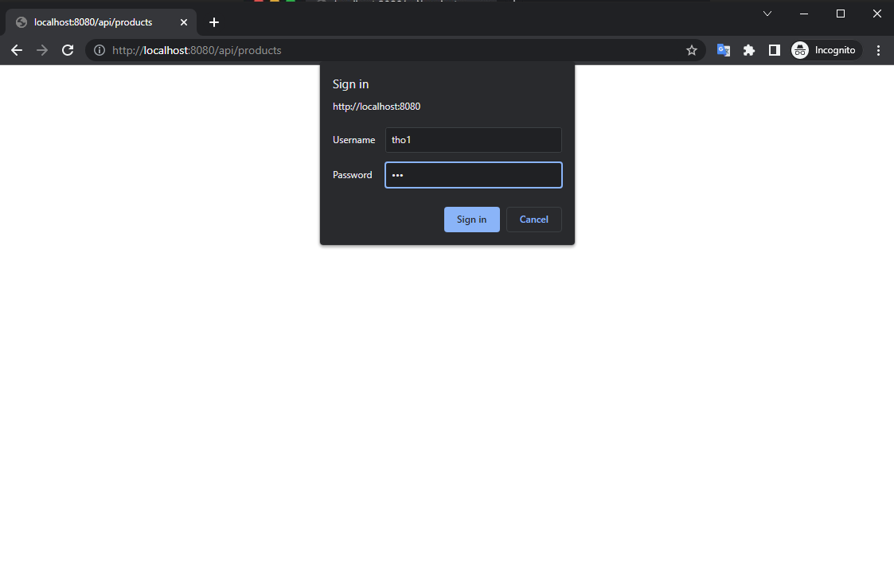
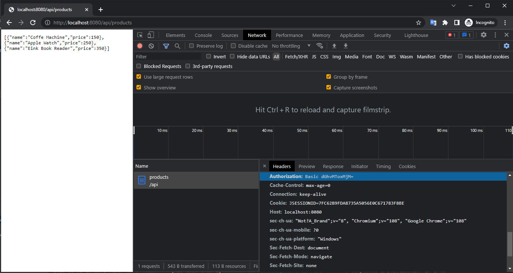
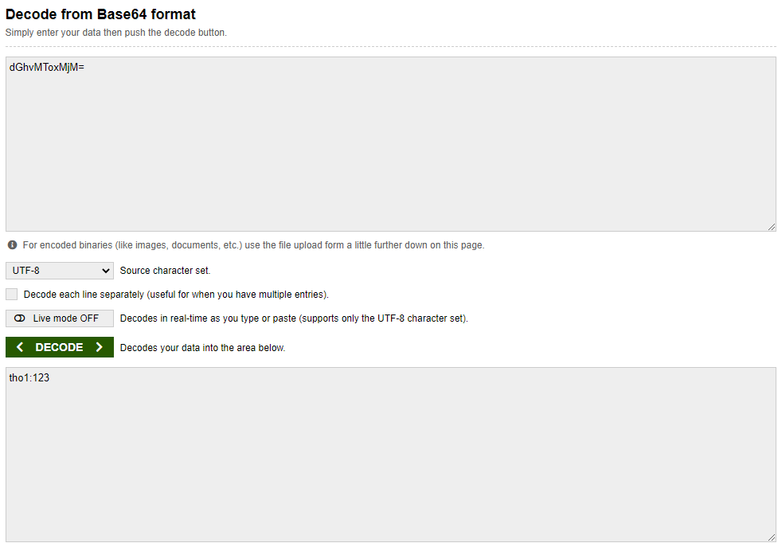
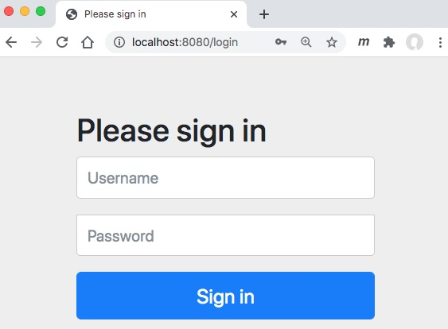
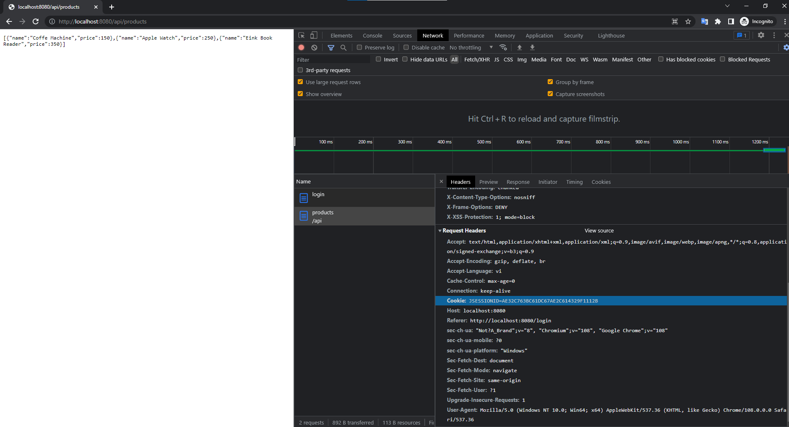
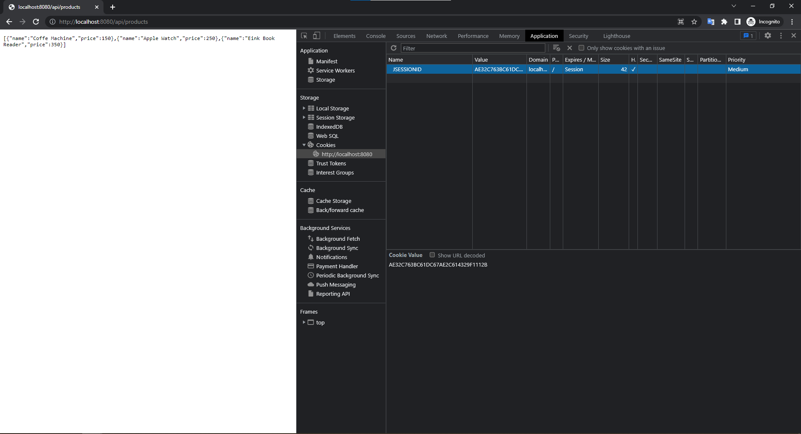

# Spring Security căn bản

Ở bài trước chúng ta tạo ra bean ```UserDetailsService``` và ```PasswordEncoder```

```java
@Configuration
public class SecurityConfig {
  @Bean
  public UserDetailsService userDetailsService() {
    var userDetailsService = new InMemoryUserDetailsManager();
    var user = User.withUsername("tientho").password("123").
    authorities("read").build();
    userDetailsService.createUser(user);
    return userDetailsService;
  }

  @Bean
  public PasswordEncoder passwordEncoder() {
    return NoOpPasswordEncoder.getInstance(); 
  }
}
```

Trong bài này chúng ta thực hiện:
1. Tìm hiểu cơ chế authentication http basic, khác gì với http.formLogin
2. Tạo nhiều user trong ```InMemoryUserDetailsManager```
3. Sử dụng BCryptPasswordEncoder thay cho NoOpPasswordEncoder
4. Tiến xa là tuỳ chọn nhiều phương án PasswordEncoder
5. Phân quyền truy cập theo đường dẫn, customize báo lỗi


## 1. Tạo class SecurityConfig.java mới

Hãy đổi tên file SecurityConfig.java hiện thời thành [SecurityConfig.java0](src/main/java/vn/techmaster/simpleauthen/security/SecurityConfig.java0)

Tạo mới file SecurityConfig.java có nội dung như sau:

```java
package vn.techmaster.simpleauthen.security;

import org.springframework.context.annotation.Configuration;
import org.springframework.security.config.annotation.authentication.builders.AuthenticationManagerBuilder;
import org.springframework.security.config.annotation.web.builders.HttpSecurity;
import org.springframework.security.config.annotation.web.configuration.WebSecurityConfigurerAdapter;
import org.springframework.security.crypto.password.NoOpPasswordEncoder;

@Configuration
@EnableWebSecurity
public class SecurityConfig extends WebSecurityConfigurerAdapter {

  @Override
  protected void configure(AuthenticationManagerBuilder auth) throws Exception {
    auth.inMemoryAuthentication().withUser("tho1").password("123")
    .authorities("read").and()
    .passwordEncoder(NoOpPasswordEncoder.getInstance());
  }

  @Override
  protected void configure(HttpSecurity http) throws Exception {
    http.httpBasic();  //Sử dụng cơ chế authentication http basic
    http.authorizeRequests().anyRequest().authenticated();  //
  }
}
```

Do chúng sử dụng ```http.httpBasic();``` nên khi truy cập, trình duyệt sẽ bật lên dialog yêu cầu đăng nhập mặc định



## 2. Cấu hình cho nhiều user
Trong ví dụ này, chúng ta tạo sẵn 3 user: tho1, tho2, tho3.


```java
package vn.techmaster.simpleauthen.security;

import java.util.ArrayList;
import java.util.Collection;

import org.springframework.context.annotation.Bean;
import org.springframework.context.annotation.Configuration;
import org.springframework.security.config.annotation.authentication.builders.AuthenticationManagerBuilder;
import org.springframework.security.config.annotation.web.builders.HttpSecurity;
import org.springframework.security.config.annotation.web.configuration.WebSecurityConfigurerAdapter;
import org.springframework.security.core.userdetails.User;
import org.springframework.security.core.userdetails.UserDetails;
import org.springframework.security.crypto.password.NoOpPasswordEncoder;
import org.springframework.security.provisioning.InMemoryUserDetailsManager;

@Configuration
public class SecurityConfig extends WebSecurityConfigurerAdapter {

  @Override
  protected void configure(HttpSecurity http) throws Exception {
    http.httpBasic();
    http.authorizeRequests().anyRequest().authenticated();
  }

  @Override
  protected void configure(AuthenticationManagerBuilder auth) throws Exception {
      auth.userDetailsService(inMemoryUserDetailsManager())
      .passwordEncoder((NoOpPasswordEncoder.getInstance()));
  }

  @Bean
  public InMemoryUserDetailsManager inMemoryUserDetailsManager() {
    Collection<UserDetails> users = new ArrayList<>();
    var tho1 = User.withUsername("tho1").password("123").
    authorities("read").build();

    var tho2 = User.withUsername("tho2").password("123").
    authorities("read").build();

    var tho3 = User.withUsername("tho3").password("123").
    authorities("read").build();

    users.add(tho1);
    users.add(tho2);
    users.add(tho3);
    return new InMemoryUserDetailsManager(users);
  }
}
```

## 3. ```http.httpBasic()``` khác gì với ```http.formLogin()```

Lệnh ```http.httpBasic();``` trong hàm ```configure``` chọn phương thức [basic authentication](https://en.wikipedia.org/wiki/Basic_access_authentication). Trong basic authentication, user name và password luôn được gửi trong header của mỗi request gửi lên server.
```java
@Override
protected void configure(HttpSecurity http) throws Exception {
  http.httpBasic();
  http.authorizeRequests().anyRequest().authenticated();
}
```
Dùng Chrome hay Edge mở địa chỉ http://localhost:8080/api/products. Nếu trình duyệt yêu cầu login hãy nhập ```{Username: tho1, Password: 123}``` . Khi server trả về dữ liệu, click chuột phải rồi chọn inspect.



Chọn tab Network, chọn mục products, rồi chọn Request Header, rồi Authorization, bạn sẽ thấy dòng text rất bí hiểm này ```dGhvMToxMjM=```. Thực chất nó là kết quả encoding base 64 của tổ hợp ```{Username: tho1, Password: 123}```. Hãy mở terminal rồi gõ lệnh

```sh
$  echo -n tho1:123 | base64
dGhvMToxMjM=
```

Giờ thì bạn đã rõ, với phương thức authentication http basic, tổ hợp Username / Password được encode chuẩn base64 rồi gán vào trường Authorization trong header của mỗi request gửi lên server. Chuỗi kết quả của mã hoá base64 hoàn toàn có thể decode rất dễ dàng. Hãy vào https://www.base64decode.org/ rồi dán chuỗi ```dGhvMToxMjM=``` rồi ấn nút DECODE, bạn sẽ nhận lại ```tho1:123```



Rõ ràng phương thức http basic authentication rất căn bản và dễ dàng bị hack nếu dùng http protocol.

Nếu thay ```http.httpBasic()``` bằng ```http.formLogin()``` thì dialog login của trình duyệt được thay thế bằng


#### Sự khác biệt giữa ```http.httpBasic()``` và  ```http.formLogin()``` là:

- ```http.httpBasic()``` gửi chuỗi UserName:Password mã hoá Base64 trong header của mỗi request
- ```http.formLogin()``` post 2 trường giá trị UserName:Password theo phương thức POST và server sẽ cài đặt cookie JSESSIONID. Mỗi lần truy cập, trình duyệt sẽ gửi lại JSESSIONID trong trường Cookie. Mà trường Cookie cũng nằm trong header của request.



Quản lý cookie. Hãy thử xoá JSESSIONID, rồi refresh lại trang, ứng dụng web sẽ yêu cầu bạn phải đăng nhập lại.


#### Cách nào bảo mật hơn, ```http.httpBasic()``` hay  ```http.formLogin()``` ?

```http.httpBasic()``` có một lỗ hổng bảo mật to đùng, đó là hacker có thể dịch ngược Username, Password khi trích xuất request header. Còn ```http.formLogin()``` hacker có thể tóm được JSESSIONID nhưng sẽ không biết được Username, Password. Hacker vẫn có thể dùng lại JSESSIONID để tạo request gửi lên server. Nhưng không thể dịch ngược ra được password của người dùng. Do đó ```http.formLogin()``` vẫn bảo mật hơn.

Tốt hơn nữa hãy chuyển từ http sang https để mã hoá toàn bộ request / response gửi qua lại trên đường truyền.

### 
Chú ý: chúng ta có thể thay thế
```java
@Override
protected void configure(AuthenticationManagerBuilder auth) throws Exception {
    auth.userDetailsService(inMemoryUserDetailsManager())
    .passwordEncoder((NoOpPasswordEncoder.getInstance()));
}
```

bằng phương thức tạo bean PasswordEncoder. Code theo cách này trong sáng hơn

```java
@Bean
public PasswordEncoder encoder() {
  return NoOpPasswordEncoder.getInstance(); 
}
```

Code của phần này [SecurityConfig.java2](src/main/java/vn/techmaster/simpleauthen/security/SecurityConfig.java2)

## 3. Sử dụng BCryptPasswordEncoder thay thế cho NoOpPasswordEncoder

```NoOpPasswordEncoder``` hoàn toàn không mã hoá password. Sau khi tạo các user lưu trong CSDL hoặc trong bộ nhớ, lập trình viên có thể lấy ra password bằng lệnh
```java
user.getPassword();
```

Do đó chúng ta cải tiến SecurityConfig.java để hỗ trợ nhiều phương pháp mã hoá password khác nhau. Xem phương thức tạo bean ```PasswordEncoder```

```java
@Configuration
public class SecurityConfig extends WebSecurityConfigurerAdapter {

  @Autowired
  private PasswordEncoder encoder;  //thêm thuộc tính này để lấy ra PasswordEncoder

  @Override
  protected void configure(HttpSecurity http) throws Exception {
    http.httpBasic();  // Sử dụng http basic authentication
    http.authorizeRequests().anyRequest().authenticated();
  }

  @Bean
  public PasswordEncoder encoder() {
    //return NoOpPasswordEncoder.getInstance();  // Không mã hoá password
    return new BCryptPasswordEncoder(); //Mã hoá password bằng BCrypt      
  }

  @Bean
  public InMemoryUserDetailsManager inMemoryUserDetailsManager() {
    Collection<UserDetails> users = new ArrayList<>();
    UserBuilder userBuilder = User.builder().passwordEncoder(encoder::encode);
    var tho1 = userBuilder.username("tho1").password("123").roles("USER").build();
    var tho2 = userBuilder.username("tho2").password("123").roles("USER").build();
    var tho3 = userBuilder.username("tho3").password("123").roles("USER").build();

    System.out.println(tho3.getPassword());  //Thử lấy ra password của một user

    users.add(tho1);
    users.add(tho2);
    users.add(tho3);
    return new InMemoryUserDetailsManager(users);
  }

}
```

#### Khác biệt giữa BCryptPasswordEncoder và NoOpPasswordEncoder

Chú ý lệnh ```System.out.println(alice.getPassword());``` trong ```public InMemoryUserDetailsManager inMemoryUserDetailsManager()```. Nếu dùng BCrypt thì password của tho3 sau khi mã hoá sẽ như thế này ```{bcrypt}$2a$10$GmFCPoSPOc3bhjzAL8X40.lZmTEteDhzjvTBXtnMreMJH3EmJMxLG```. Còn nếu dùng ```NoOpPasswordEncoder``` thì password của alice không được mã hoá ```123```. done !

Mã nguồn của phần này ở [SecurityConfig.java3](src/main/java/vn/techmaster/simpleauthen/security/SecurityConfig.java3)


## 4. Sử dụng các Password Encoder khác nhau

Phần này các bạn nên tham khảo thêm [Password Encoder Migration with Spring Security 5]
(https://blog.marcosbarbero.com/password-encoder-migration-spring-security-5/)

Tạo mới phương thức có thể tạo ra PasswordEncoder them tham số đầu vào ```encodingType```
```java
public static PasswordEncoder delegatePasswordEncoder(String encodingType) {
  Map<String, PasswordEncoder> encoders = new HashMap<>();
  encoders.put("bcrypt", new BCryptPasswordEncoder());
  encoders.put("pbkdf2", new Pbkdf2PasswordEncoder());
  encoders.put("scrypt", new SCryptPasswordEncoder());

  //Các cách mã hoá password cũ, thiếu bảo mật
  encoders.put("ldap", new LdapShaPasswordEncoder());
  encoders.put("MD4", new Md4PasswordEncoder());
  encoders.put("MD5", new MessageDigestPasswordEncoder("MD5"));
  encoders.put("noop", NoOpPasswordEncoder.getInstance());    
  encoders.put("SHA-1", new MessageDigestPasswordEncoder("SHA-1"));
  encoders.put("SHA-256", new MessageDigestPasswordEncoder("SHA-256"));
  encoders.put("sha256", new StandardPasswordEncoder());

  return new DelegatingPasswordEncoder(encodingType, encoders);      
}
```

Chỉnh lại phương thức tạo bean ```PasswordEncoder```. Trong ví dụ này tôi chọn ```pbkdf2```

```java
@Bean
public PasswordEncoder encoder() {
    return SecurityConfig.delegatePasswordEncoder("pbkdf2");
}
```
Giờ thì password của alice ban đầu là ```123``` khi được mã hoá bởi ```Pbkdf2PasswordEncoder``` thành ra thế này
```{pbkdf2}b5382057edb548bf64ca853c64405f676ade834232fd5bcad67e15aac618e8ca0d6a9ba8205401a9```

Nhìn cũng ra gì phết chứ.

Tuy nhiên trong request của trình duyệt gửi lên server, thì Username/Password vẫn chỉ được encode bởi Base64 thôi. Các bạn chú ý điểm này nhé.

Code phần này ở [SecurityConfig.java4](src/main/java/vn/techmaster/simpleauthen/security/SecurityConfig.java4)

## 5. Phần quyền Roles

Trong phần thực hành này chúng ta sẽ thí nghiệm phân quyền (role). Mỗi một user có thể có 1 hoặc nhiều role.

Định nghĩa Role ở file [Role.java](src/main/java/vn/techmaster/simpleauthen/security/Role.java)
```java
public class Role {
  public static final String ADMIN = "ADMIN";  //Nhớ luôn dùng static final để 
  public static final String USER = "USER";
  public static final String OPERATOR = "OPERATOR";

  private Role() {} //tạo private constructor để dập warning
}
```

Quy tắc phân quyền truy cập ứng dụng này như sau
1. ```/api/products```: role USER, OPERATOR, ADMIN được phép truy cập. Anonymous user không được phép
2. ```/api/backoffice```: role OPERATOR, ADMIN xem được
3. ```/api/secret```: duy nhất role ADMIN xem được
4. Các địa chỉ khác user nào cũng xem được

Triển khai bằng code như sau

```java
@Override
protected void configure(HttpSecurity http) throws Exception {
  http.httpBasic();
  http.authorizeRequests()
  .antMatchers("/api/products").hasAnyRole(Role.USER, Role.OPERATOR, Role.ADMIN)
  .antMatchers("/api/backoffice").hasAnyRole(Role.OPERATOR, Role.ADMIN)
  .antMatchers("/api/secret").hasRole(Role.ADMIN)
  .antMatchers("/**").permitAll();
}
```

Gán role cho user như dưới
```java
@Bean
public InMemoryUserDetailsManager inMemoryUserDetailsManager() {
  Collection<UserDetails> users = new ArrayList<>();
  UserBuilder userBuilder = User.builder().passwordEncoder(encoder()::encode);
  var tom = userBuilder.username("tom@gmail.com").password("123").roles(Role.USER).build();
  var bob = userBuilder.username("bob@gmail.com").password("123").roles(Role.USER).build();
  var alice = userBuilder.username("alice@gmail.com").password("123").roles(Role.USER).build();

  var operator = userBuilder.username("operator@gmail.com").password("123").roles(Role.OPERATOR).build();
  var boss = userBuilder.username("boss@gmail.com").password("123").roles(Role.ADMIN, Role.USER).build();

  users.add(tom);
  users.add(bob);
  users.add(alice);
  users.add(operator);
  users.add(boss);

  return new InMemoryUserDetailsManager(users);
}
```

#### Một vài thay đổi nhỏ trong phần này.
1. Bỏ
  ```java
    @Autowired
    private PasswordEncoder encoder;
  ```
2. Thay
  ```java
    UserBuilder userBuilder = User.builder().passwordEncoder(encoder::encode);
  ```
  bằng

  ```java
    UserBuilder userBuilder = User.builder().passwordEncoder(encoder()::encode);
  ```

Xem chi tiết tại [SecurityConfig.java5](src/main/java/vn/techmaster/simpleauthen/security/SecurityConfig.java5)
#### Customize trang báo lỗi 403, 404, 500
1. Vào [application.properties](src/main/resources/application.properties) thêm dòng này để tắt báo lỗi kiểu White Label page
```
server.error.whitelabel.enabled=false
```

2. Thêm ```spring-boot-starter-thymeleaf``` vào [pom.xml](pom.xml), 
```xml
<dependency>
  <groupId>org.springframework.boot</groupId>
  <artifactId>spring-boot-starter-thymeleaf</artifactId>
</dependency>
```
3. Tạo thư mục [error](src/main/java/vn/techmaster/bookstore/error) trong resources/templates cùng với các file [403.html](src/main/resources/templates/error/403.html), [404.html](target/classes/templates/error/404.html), [500.html](target/classes/templates/error/500.html)

```
resources
  ├── static
  ├── templates
  │   ├── error
  │   │   ├── 403.html
  │   │   ├── 404.html
  │   │   └── 500.html
  │   └── index.html
  └── application.properties
```

Bạn có thể customize báo lỗi sâu hơn bằng file [ErrorHandler.java](src/main/java/vn/techmaster/simpleauthen/controller/ErrorHandler.java0). Tôi tạm đổi tên ErrorHandler.java thành ErrorHandler.java0 vì chỉ cần cấu hình mặc định.

#### Thử nghiệm

Biên dịch ứng dụng rồi login với các Username khác nhau: tom, bob, alice, operator, boss và truy cập vào các đường dẫn:

- http://localhost:8080/
- http://localhost:8080/api/products
- http://localhost:8080/api/backoffice
- http://localhost:8080/api/secret


